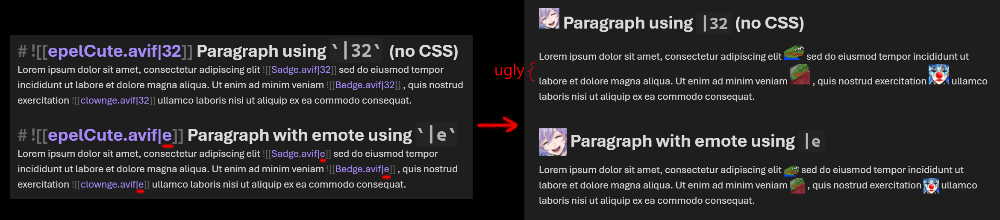
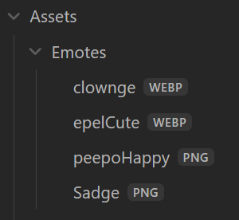

For people who are addicted to using Twitch emotes everywhere and want to use them in their Obsidian notes. This CSS snippet prevents emote images from affecting line spacing.



# Get started
1. Download and place `emotes.css` into your "snippets" folder in your Obsidian vault directory.
2. Apply the "emotes" CSS snippet in Obsidian ([help](https://help.obsidian.md/Extending+Obsidian/CSS+snippets)).

# Usage
Embed an image normally in Obsidian ([help](https://help.obsidian.md/Linking+notes+and+files/Embed+files)):
```
![[image.png]]
```

Turn the image into an emote:
```
![[image.png|emote]]
```
Personally, I keep a folder for emote images in my vault with all my notes to ensure **offline availability**, like so: 



This also allows you to drag and drop the emotes from the Obsidian sidebar without having to type the file name out.

The other way that would require an Internet connection and not have to save the images would be to embed the image's URL.

# Additional references
[Get Obsidian](https://obsidian.md)